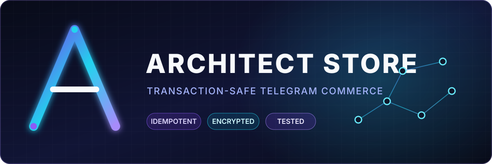
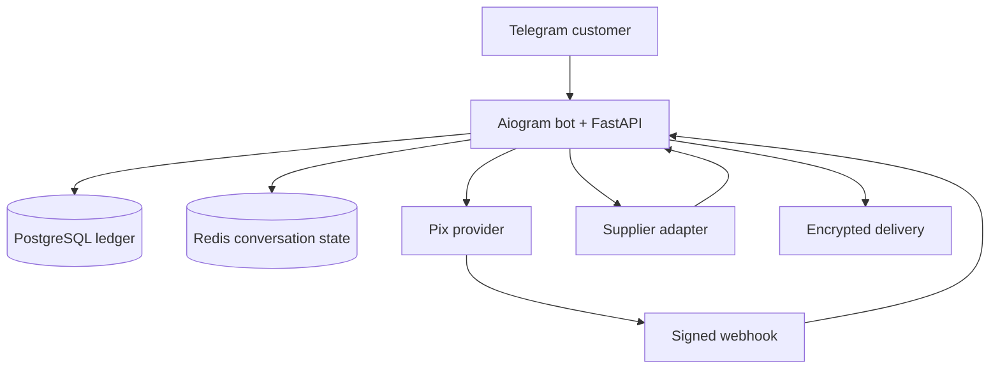

<div align="center">

# Architect Store

**A transaction-safe Telegram commerce engine for legitimate digital goods.**


[](https://github.com/DevKaz-source/architect-store/actions/workflows/ci.yml)

[Português](README.pt-BR.md) · [Architecture](#architecture) · [Run locally](#run-locally) · [Security](SECURITY.md)

</div>

> **Portfolio / sandbox project.** The current public build does not sell real products.
> Mock payments and mock supplier codes have no monetary value.

## Why this project stands out

Most commerce bot demos stop at menus and payment links. Architect Store focuses on the
hard backend problems that appear when money, inventory and third-party APIs share the
same workflow:

- an append-only wallet ledger with idempotent balance mutations;
- atomic purchase, debit and stock allocation in PostgreSQL;
- signed Mercado Pago webhooks and provider-side payment verification;
- automatic supplier reconciliation after pending or ambiguous responses;
- duplicate-purchase protection when a supplier response is lost after charging;
- encrypted stock, deliveries and support messages;
- automatic refunds when a supplier rejects an order safely;
- margin and currency guards before an external purchase is submitted.

## Validation status

| Capability | Evidence | Status |
|---|---|---|
| Wallet, orders, stock and support | Automated test suite | ✅ Validated |
| Pix via Mercado Pago Orders API | End-to-end sandbox transaction | ✅ Validated |
| Mock supplier: immediate delivery | Telegram end-to-end purchase | ✅ Validated |
| Supplier rejection | Automatic wallet refund | ✅ Validated |
| Pending supplier order | Background reconciliation and delivery | ✅ Validated |
| Lost/ambiguous supplier response | Existing transaction recovered without a second debit | ✅ Validated |
| Reloadly adapter | Unit tests and API contract implementation | 🟡 External sandbox pending |
| Production sales | Requires an approved supplier and operational rollout | ⛔ Not enabled |

Latest local quality gate:

```text
25 passed, 5 subtests passed
All checks passed!
```

## Architecture



The wallet balance is a transactional cache. `wallet_entries` is the authoritative,
append-only ledger, and every credit, debit and refund carries a unique idempotency key.
Monetary values are stored as integer cents.

For external products, an order receives a stable supplier identifier before any API
request. A timeout never triggers a blind retry: the reconciler searches for the original
transaction and either delivers it, keeps it under review or refunds only when rejection
is known to be safe.

## Technology

| Layer | Stack |
|---|---|
| Bot and HTTP API | Python 3.12, Aiogram 3, FastAPI, Uvicorn |
| Persistence | PostgreSQL 17, SQLAlchemy 2, Alembic |
| Conversation state | Redis 7 |
| Payments | Mercado Pago Orders API, mock provider |
| Suppliers | Adapter interface, deterministic mock, Reloadly adapter |
| Security | Fernet encryption, signed webhooks, idempotency, read-only container |
| Quality | Pytest, Ruff, Docker multi-stage builds, GitHub Actions |

## Run locally

Requirements: Docker with Compose, a Telegram bot token created through `@BotFather`,
and your numeric Telegram user ID.

```bash
cp .env.example .env
python scripts/generate_secrets.py
```

On PowerShell, use `Copy-Item .env.example .env` for the first command. Add the generated
values and your Telegram credentials to `.env`, while keeping both providers in mock mode:

```dotenv
APP_ENV=development
TELEGRAM_MODE=polling
PIX_PROVIDER=mock
GIFTCARD_PROVIDER=mock
MOCK_SUPPLIER_SCENARIO=success
```

Build, migrate and seed the zero-value catalog:

```bash
docker compose build app
docker compose up -d db redis
docker compose run --rm app alembic upgrade head
docker compose run --rm app python -m app.cli mock-catalog
docker compose run --rm app python -m app.cli seed-mock-products
docker compose run --rm app python -m app.polling
```

See the complete Windows and failure-simulation guide in
[`docs/MOCK_SUPPLIER.md`](docs/MOCK_SUPPLIER.md).

## Quality gate

The same containerized gate runs locally and in CI:

```bash
docker compose --profile test build test
docker compose --profile test run --rm test
```

It executes all tests and then checks the application, migrations, scripts and tests with
Ruff. No production credentials are required.

## Repository map

| Path | Responsibility |
|---|---|
| `app/bot/` | Telegram commands, callbacks and customer/admin flows |
| `app/services/` | Transaction boundaries and business rules |
| `app/payments/` | Pix provider interface and implementations |
| `app/suppliers/` | Supplier interface, mock scenarios and Reloadly adapter |
| `migrations/` | Versioned PostgreSQL schema |
| `tests/` | Money, security, payment and supplier invariants |
| `docs/` | Deployment, compliance and integration runbooks |

## Security and responsible use

- `.env`, local databases, imported stock and build artifacts are excluded from Git.
- Mock providers are rejected automatically when `APP_ENV=production`.
- Real inventory must come from suppliers that explicitly authorize resale.
- Production rollout requires HTTPS webhooks, secret rotation, backups, monitoring,
  verified policies and a low-value closed pilot.

Read [`docs/SECURITY.md`](docs/SECURITY.md) and
[`docs/COMPLIANCE_CHECKLIST.md`](docs/COMPLIANCE_CHECKLIST.md) before any live use.

## Roadmap

- [x] Transactional wallet and encrypted manual inventory
- [x] Mercado Pago Pix sandbox integration
- [x] Supplier adapter with safe reconciliation
- [x] Deterministic failure simulation and automated tests
- [ ] Public staging deployment with health checks
- [ ] Approved supplier sandbox validation
- [ ] Monitoring, backups and restore drill
- [ ] Closed production pilot with legitimate inventory

## License

No open-source license has been granted yet. The source is public for portfolio review and
technical evaluation; reuse rights remain reserved.

## Author

Built by **Kaz** — [@DevKaz-source](https://github.com/DevKaz-source).

Python developer focused on automation, Telegram bots and transaction-safe backend
systems. Available for freelance projects.
