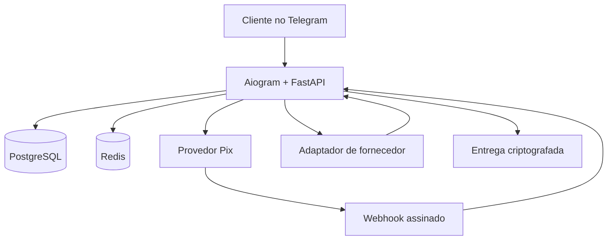

[Read in English](README.md)

# Architect Store · Loja Digital para Telegram

MVP de uma loja legítima de produtos digitais com catálogo, crédito interno via Pix,
entrega automática de estoque ou fornecedor, histórico de compras, suporte e administração.

O projeto foi desenhado para gift cards, licenças, links de ativação e credenciais cuja
revenda esteja expressamente autorizada. O software não valida a origem comercial do
estoque: mantenha contratos, notas e autorizações de cada fornecedor.

## O que já está implementado

- Bot em português com catálogo, saldo, recarga, compras e suporte.
- Identidade visual da Architect Store, painel inicial com saldo acima do banner e menu
  inline anexado à vitrine.
- Pix via API de Orders do Mercado Pago, além de provedor `mock` para desenvolvimento.
- QR Code, Pix Copia e Cola e link de pagamento.
- Webhooks do Telegram e Mercado Pago autenticados.
- Crédito somente após consultar o pedido no provedor e confirmar
  `processed/accredited`.
- Idempotência no pagamento, no lançamento do saldo e na compra.
- Razão contábil de todas as alterações da carteira.
- Compra, débito e baixa de estoque na mesma transação PostgreSQL.
- Adaptador Reloadly Gift Cards implementado e coberto por testes unitários; a
  homologação externa aguarda uma conta aprovada pelo fornecedor.
- Fornecedor `mock` local com catálogo, custos, entregas e falhas inteiramente fictícios.
- Pedidos de fornecedor com reserva de saldo, identificador único, conciliação e entrega
  criptografada; timeouts nunca provocam uma segunda compra automática.
- Estoque e mensagens de suporte criptografados com Fernet.
- Recuperação da entrega no histórico de pedidos.
- Chamados com comandos de resposta e encerramento para administradores.
- CLI para catálogo, estoque, aprovação mock e ajustes auditáveis.
- Docker, PostgreSQL, Alembic e testes unitários do núcleo.

## Arquitetura



O `balance_cents` da carteira é um cache transacional. O histórico definitivo está em
`wallet_entries`, que usa chaves únicas de idempotência. Os valores monetários são sempre
inteiros em centavos.

## Início rápido em modo de teste

Requisitos: Docker com Compose, um bot criado no `@BotFather` e seu Telegram ID numérico.

1. Copie `.env.example` para `.env`.
2. Gere os segredos:

   ```bash
   python scripts/generate_secrets.py
   ```

3. Preencha no `.env`:

   - `TELEGRAM_BOT_TOKEN`
   - `TELEGRAM_WEBHOOK_SECRET`
   - `DATA_ENCRYPTION_KEY`
   - `ADMIN_TELEGRAM_IDS`
   - `POSTGRES_PASSWORD`
   - `PIX_PROVIDER=mock`
   - `GIFTCARD_PROVIDER=mock`
   - `MOCK_SUPPLIER_SCENARIO=success`
   - `TELEGRAM_MODE=polling` para testar sem domínio HTTPS

4. Suba o banco e o Redis:

   ```bash
   docker compose up -d db redis
   docker compose run --rm app alembic upgrade head
   ```

5. Crie três produtos automáticos totalmente fictícios:

   ```bash
   docker compose run --rm app python -m app.cli mock-catalog
   docker compose run --rm app python -m app.cli seed-mock-products
   ```

6. Aplique a identidade da Architect Store ao perfil do bot:

   ```bash
   docker compose run --rm --no-deps app python -m app.cli telegram-brand
   ```

   Esse comando configura foto, nome, descrições e comandos. O `@username` continua sendo
   alterado exclusivamente pelo `@BotFather`.

7. Com `TELEGRAM_MODE=polling`, rode o bot localmente:

   ```bash
   docker compose run --rm app python -m app.polling
   ```

8. Como alternativa, cadastre um produto de estoque manual:

   ```bash
   docker compose run --rm app python -m app.cli add-product \
     --slug gift-card-50 \
     --name "Gift Card R$ 50" \
     --price "54,90" \
     --description "Código digital com entrega imediata" \
     --delivery-type code \
     --supplier-reference "CONTRATO-FORNECEDOR-001"
   ```

9. Crie `stock-gift-card.txt`, com uma entrega por linha, e importe:

   ```bash
   docker compose run --rm \
     -v "$PWD/stock-gift-card.txt:/tmp/stock-gift-card.txt:ro" app \
     python -m app.cli import-stock \
     --product gift-card-50 \
     --file /tmp/stock-gift-card.txt
   ```

   Para uma entrega com várias linhas, use uma string JSON em uma única linha:
   `"Login: cliente@example.com\nSenha: exemplo\nInstruções: troque a senha"`.
   Arquivos `stock-*.txt` são ignorados pelo Git e devem ser apagados com segurança após
   a importação.

10. No bot, gere um Pix mock e aprove o identificador exibido:

   ```bash
   docker compose run --rm app python -m app.cli approve-mock UUID-DO-DEPOSITO
   ```

Agora compre um item `[TESTE]` no catálogo. A entrega começa com
`TESTE-SEM-VALOR-` e não pode ser resgatada. O roteiro detalhado para Windows/VS Code,
incluindo cenários de pendência e reembolso, está em
[docs/MOCK_SUPPLIER.md](docs/MOCK_SUPPLIER.md).

## Ativando o primeiro fornecedor: Reloadly Sandbox

1. Crie sua conta Reloadly, ative **Test mode** no painel e copie o Client ID e Client
   Secret de teste. Não coloque essas chaves no código nem envie por Telegram.
2. No `.env`, adicione:

   ```dotenv
   GIFTCARD_PROVIDER=reloadly
   RELOADLY_ENABLED=true
   RELOADLY_ENVIRONMENT=sandbox
   RELOADLY_CLIENT_ID=SEU_CLIENT_ID_DE_TESTE
   RELOADLY_CLIENT_SECRET=SEU_CLIENT_SECRET_DE_TESTE
   RELOADLY_SENDER_NAME=Architect Store
   RELOADLY_LIVE_ENABLED=false
   ```

3. Recrie a imagem e aplique a migração:

   ```bash
   docker compose build app
   docker compose run --rm app alembic upgrade head
   ```

4. Confira a conexão, sincronize o Brasil e procure um produto:

   ```bash
   docker compose run --rm app python -m app.cli reloadly-balance
   docker compose run --rm app python -m app.cli reloadly-sync --country BR
   docker compose run --rm app python -m app.cli reloadly-catalog --country BR --search "Google"
   ```

5. Vincule uma denominação a um preço de venda. O produto nasce pausado por segurança:

   ```bash
   docker compose run --rm app python -m app.cli add-reloadly-product \
     --slug google-play-50 \
     --product-id ID_EXIBIDO_NO_CATALOGO \
     --country BR \
     --denomination 50 \
     --sale-price "57,90" \
     --name "Google Play R$ 50"
   docker compose run --rm app python -m app.cli set-product-active \
     --product google-play-50 --state on
   ```

6. Faça a compra completa no bot usando saldo de teste. O código retornado pela Sandbox
   aparecerá protegido no Telegram. Se o fornecedor deixar a transação pendente:

   ```bash
   docker compose run --rm app python -m app.cli list-review-supplier-orders
   docker compose run --rm app python -m app.cli reconcile-supplier-order \
     --order PED-XXXXXXXX
   ```

O conciliador também roda automaticamente enquanto o bot está ligado. Veja o passo a
passo e a trava para dinheiro real em [docs/RELOADLY.md](docs/RELOADLY.md).

## Ativando Pix real

1. Crie uma aplicação para pagamentos online, Checkout Transparente e API de Orders.
2. Homologue primeiro com o Access Token de teste e configure
   `MERCADO_PAGO_TEST_MODE=true`. Nesse modo, o bot envia `payer.first_name=APRO`,
   junto ao e-mail de sandbox `test_user_br@testuser.com`, conforme o cenário oficial de
   teste de Pix. Use uma recarga de `R$ 50,00`, aguarde a atualização automática e
   pressione **Já paguei · verificar**.
3. Cadastre a URL HTTPS `https://SEU-DOMINIO/webhooks/mercado-pago` para o evento
   **Order (Mercado Pago)** e copie a chave secreta do webhook.
4. Após a homologação, ative as credenciais de produção e configure:

   ```dotenv
   PIX_PROVIDER=mercado_pago
   MERCADO_PAGO_TEST_MODE=false
   MERCADO_PAGO_ACCESS_TOKEN=APP_USR-...
   MERCADO_PAGO_WEBHOOK_SECRET=...
   TELEGRAM_MODE=webhook
   APP_ENV=production
   APP_BASE_URL=https://SEU-DOMINIO
   ```

5. Execute `docker compose up -d --build` e faça uma compra real de valor baixo.

Referências oficiais usadas na implementação:

- [Pix com API de Orders](https://www.mercadopago.com.br/developers/pt/docs/checkout-api-orders/payment-integration/pix)
- [Webhooks de Orders](https://www.mercadopago.com.br/developers/pt/docs/checkout-api-orders/notifications)
- [Telegram Bot API: setWebhook](https://core.telegram.org/bots/api#setwebhook)
- [Reloadly Gift Cards API](https://docs.reloadly.com/gift-cards)
- [Reloadly Sandbox](https://developers.reloadly.com/developer-tools/sandbox)

## Administração

No Telegram, apenas IDs de `ADMIN_TELEGRAM_IDS` podem usar:

- `/admin`
- `/tickets`
- `/ver SUP-XXXXXXXX`
- `/responder SUP-XXXXXXXX mensagem`
- `/fechar SUP-XXXXXXXX`

O cliente responde a um chamado existente com
`/responder_suporte SUP-XXXXXXXX mensagem`.

No servidor:

```bash
python -m app.cli list-products
python -m app.cli set-product-active --product gift-card-50 --state off
python -m app.cli list-review-deposits
python -m app.cli reconcile-pix ORD-ID-DO-PROVEDOR
python -m app.cli adjust-balance --telegram-id 123 --amount "10,00" --reason "Crédito promocional"
python -m app.cli refund-order --order PED-XXXXXXXX --reason "Código inválido confirmado"
python -m app.cli block-user --telegram-id 123 --state on
```

O cadastro de estoque é deliberadamente restrito ao servidor. Isso evita enviar códigos,
logins e senhas pelo Telegram.

## Testes

Com as dependências de desenvolvimento instaladas:

```bash
pip install -e ".[dev]"
pytest -q
ruff check app migrations scripts tests
```

Ou, sem instalar Python no Windows, use o alvo de testes do Docker:

```bash
docker compose --profile test build test
docker compose --profile test run --rm test
```

Antes de produção, siga [docs/DEPLOYMENT.md](docs/DEPLOYMENT.md) e
[docs/COMPLIANCE_CHECKLIST.md](docs/COMPLIANCE_CHECKLIST.md).

## Limites do MVP

- A administração de catálogo/estoque é por CLI; um painel web pode ser a próxima etapa.
- Sem `REDIS_URL`, o estado das perguntas usa memória para facilitar o teste local. Em
  produção, a configuração exige Redis e preserva esses fluxos durante reinicializações.
- Reembolsos de produtos são manuais e exigem conferência do suporte.
- Reloadly está implementada; outros distribuidores continuam dependendo de novos adaptadores.
- Produtos e códigos do fornecedor mock são simulações sem qualquer valor comercial.
- Produtos Reloadly que exigem `userId` do comprador ficam bloqueados até existir um fluxo
  específico para coletar e validar esse dado.
- A venda automática Reloadly exige custo verificável em BRL; ofertas em outra moeda ficam
  bloqueadas até existir conversão cambial auditável.
- Emissão fiscal, contabilidade e textos jurídicos dependem da empresa e do município.

## Autor

Desenvolvido por **Kaz** — [@DevKaz-source](https://github.com/DevKaz-source).

Desenvolvedor Python focado em automações, bots para Telegram e backends transacionais.
Disponível para projetos freelance.
